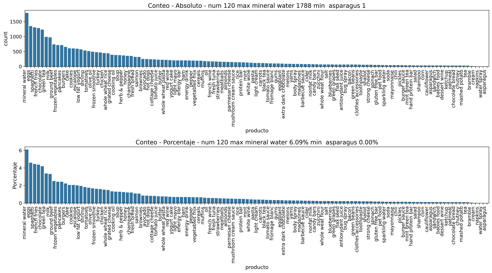
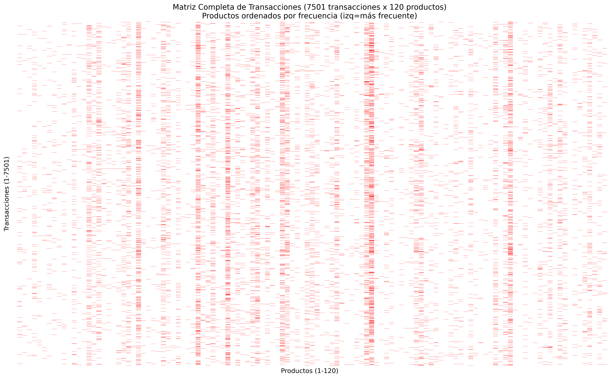
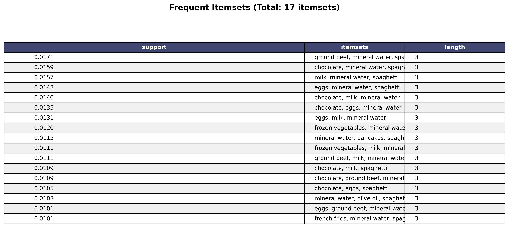

# Ejemplos de Algoritmos de Data Mining

Este repositorio contiene ejemplos prácticos de algoritmos de data mining implementados en Python.

## Estructura del Proyecto

```
.
├── algoritmo_apriori/       # Market Basket Analysis (Apriori)
├── algoritmo_rfm/           # RFM Analysis
└── ...                      # Otros algoritmos
```

## Configuración del Entorno

### 1. Crear y activar el entorno virtual

```bash
# Opción automática: usar el script
./create_venv.sh

# O manualmente:
python3 -m venv .venv
source .venv/bin/activate
pip install -r requirements.txt
```

### 2. Ejecutar un algoritmo

```bash
# Asegúrate de que el entorno virtual esté activado
source .venv/bin/activate

# Navega a la carpeta del algoritmo
cd algoritmo_apriori

# Ejecuta el script
python main.py
```

## Algoritmos Incluidos

### Apriori (Market Basket Analysis)

<p align="center">
  
  
  
</p>

- **Ubicación**: `algoritmo_apriori/`
- **Descripción**: Análisis de asociación para descubrir patrones de compra
- **Dependencias**: pandas, matplotlib, seaborn, mlxtend

### RFM Analysis
- **Ubicación**: `algoritmo_rfm/`
- **Descripción**: Análisis de Recencia, Frecuencia y Valor Monetario
- **Dependencias**: pandas, matplotlib, seaborn

## Requisitos

- Python 3.8+
- Ver `requirements.txt` para la lista completa de dependencias

## Notas

- Cada carpeta de algoritmo puede tener su propio `requirements.txt` como documentación de dependencias específicas
- El entorno virtual `.venv/` está en `.gitignore` y no se versiona
- Todos los algoritmos comparten el mismo entorno virtual para eficiencia
